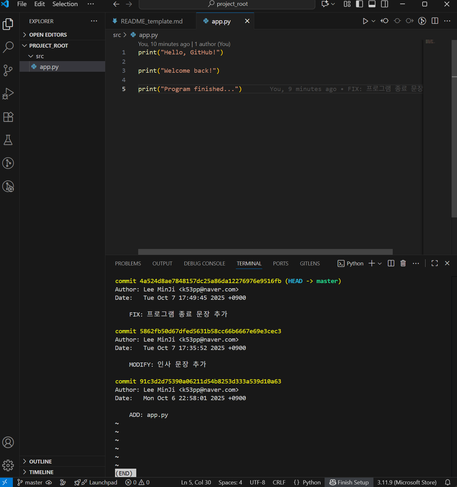
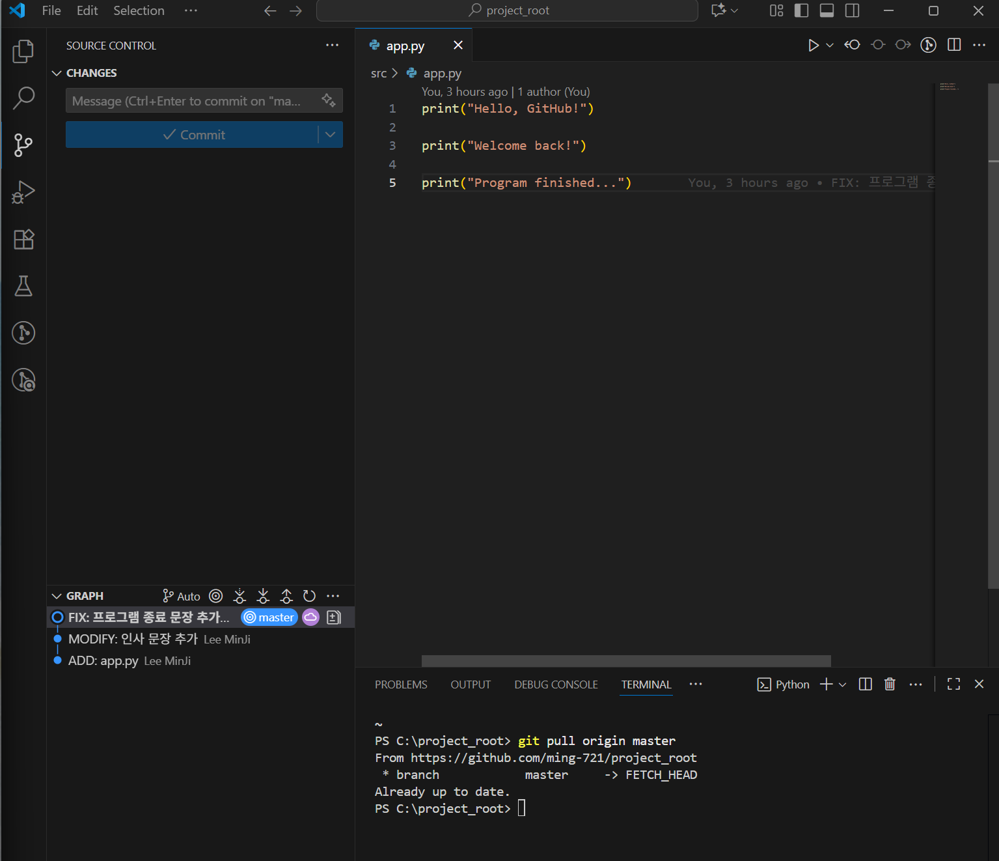

## 프로젝트 폴더 구조

```
C:.
│  
├─doc
│  └─images
│          capture1.png
│          capture2.png
│          
├─README.md
└─src
        app.py
```

## 수행 과정
1. **프로젝트 구조 생성**
2. **src/app.py 작성 및 첫 번째 커밋**
   - 커밋 메세지 : `ADD: app.py`
   - 내용: 기본 출력 코드 작성 (`print("Hello, GitHub!")`)
3. **두 번째 커밋**
   - 커밋 메세지 : `MODIFY: 인사 문장 추가`
   - 추가한 내용 : 추가 인사 문장 출력 코드 수정
4. **세 번째 커밋**
   - 커밋 메시지: `FIX: 프로그램 종료 문장 추가`
   - 수정한 내용: 출력 순서 수정 및 종료 문구 추가
5. **화면 캡쳐**
     
   
6. **느낀 점**
   - 이번 과제는 생각보다 시간도 많이 걸리고 어려웠으나 익숙해지면 언제 어려웠다는 듯 쉽게 할 수 있을 거라고 생각한다.
   - 다음에는 더 깔끔하고 빠른 시간 내에 프로젝트를 만들어내고 싶다.
